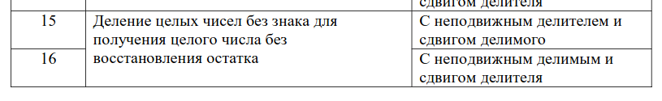

# Задание

Деление целых чисел без знака для получения целого числа без восстановления остатка с неподвижным делителем и сдвигом делимого

# Задание по варианту

Номер алгоритма 14 mod 16 + 1 = 15

Разрядность: 14 mod 7 + 4 = 4



# Решение

## Описание алгоритма деления чисел без знака без восстановления остатка

1. Исходное значение частичного остатка (ЧО) полагается равным старшим разрядам делимого.
2. Из ЧО вычитается делитель и анализируется знак остатка.
3. Если остаток положительный, то деление невозможно, формируется признак переполнения и процесс завершается, в противном случае ЧО восстанавливается путем прибавления делителя и деление продолжается.
4. Частичный остаток сдвигается на один разряд влево, а в освобождающийся при сдвиге младший разряд ЧО заносится очередная цифра делимого.
5. Из сдвинутого ЧО вычитается делитель, если остаток положителен, и к сдвинутому частичному остатку прибавляется делитель, если остаток отрицательный
6. Очередная цифра модуля частного равна единице, если результат операции (сложения или вычитания) положителен, и нулю, если он отрицателен.
7. Пункты 4–6 последовательно выполняются для получения всех цифр модуля частного

## Описание обозначений:

A – делимое;
B – делитель;
Q – частное;
R - остаток;
i – счётчик;

## Описание решения

Инициализируем беззнаковые четырёхразрядные А и В и беззнаковую восьмиразрядную R.

Кладём старший разряд делимого A в R, так как А - четырёхразрядное число, в R мы всегда кладём 0.

Затем идёт проверка на делимость - если R больше или равно B - отмечаем переполнение и выходим.

Ставим счётчик i равным трём.

Сдвигаем R на один бит влево и логически складываем с i-ным битом числа A начиная справа (i-ный бит мы получаем путём логического умножения сдвинутой на i бит вправо А и единицы)

Если R положительно, мы вычитаем из R B, в противном случае мы их складываем.

Затем сдвигаем Q на один бит влево и, если R в итоге оказалось положительным, увеличиваем Q на 1

В конце концов уменьшаем i на один, и если i стала меньше 0, выводим Q и выходим из программы


# Примеры

## деление 12 на 5

```
A = 12 (1100)
B = 5 (0101)
R = 0
Q = 0

i = 3
(A >> 3) & 1 = 1
R = 0 | 1 = 1
R = 1 - 5 = -4
Q = 0000

i = 2
(A >> 2) & 1 = 1
R = -8 | 1 = -7
R = -7 + 5 = -2
Q = 0000

i = 1

(A >> 1) & 1 = 0
R = -4
R = -4 + 5 = 1
Q = 0001

i = 0

(A >> 1) & 1 = 0
R = 2
R = 2 - 5 = -3
Q = 0010

i = -1

Q = 0010 = 2
```

## Деление 5 на 2

```
A = 5 (0101)
B = 2 (0010)
R = 0
Q = 0

i = 3
(A >> 3) & 1 = 0
R = 0
R = 0 − 2 = -2
Q = 0000

i = 2
(A >> 2) & 1 = 1
R = -4 | 1 = -3
R = -3 + 2 = -1
Q = 0000

i = 1
(A >> 1) & 1 = 0
R = -2
R = -2 + 2 = 0
Q = 0001

i = 0
(A >> 0) & 1 = 1
R = 0 | 1 = 1
R = 1 − 2 = -1
Q = 0010

i = -1
Q = 0010 = 2
```

# Список использованной литературы

cilker_organizaciya_evm_i_sistem.pdf