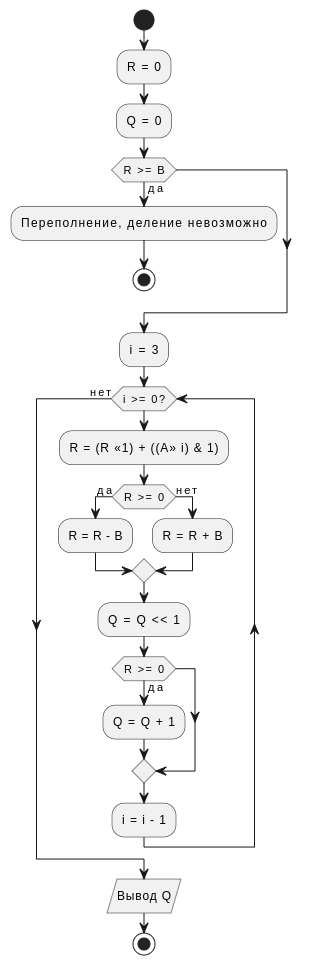
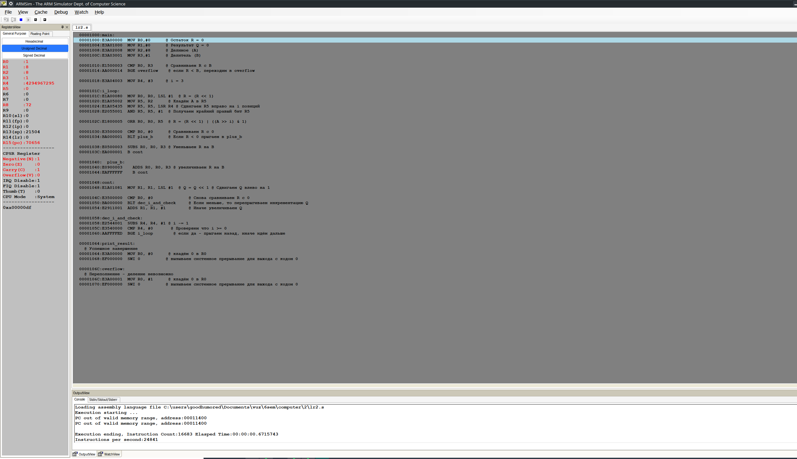

# Задание

Деление целых чисел без знака для получения целого числа без восстановления остатка с неподвижным делителем и сдвигом делимого

# Задание по варианту

Номер алгоритма 14 mod 16 + 1 = 15

Разрядность: 14 mod 7 + 4 = 4

# Блок-схема алгоритма

# Код программы на языке ассемблера ARM

~~~{include=./lr2.s .asm caption="Код программы"}
~~~

| регистр | переменная   |
| :------ | ------------ |
| R0      | Остаток R    |
| R1      | Результат Q  |
| R2      | Делимое (A)  |
| R3      | Делитель (B) |
| R4      | i счетчик    |
:Используемые регистры

