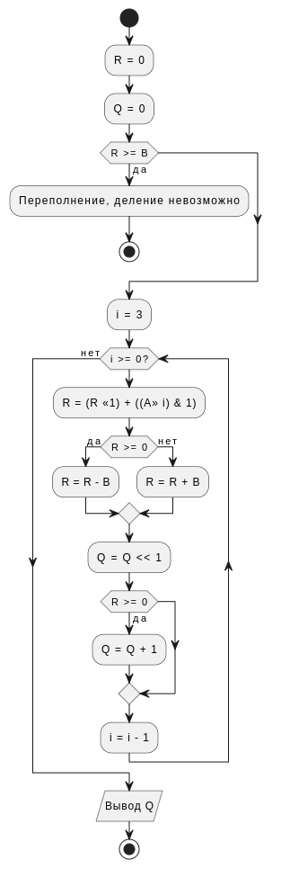
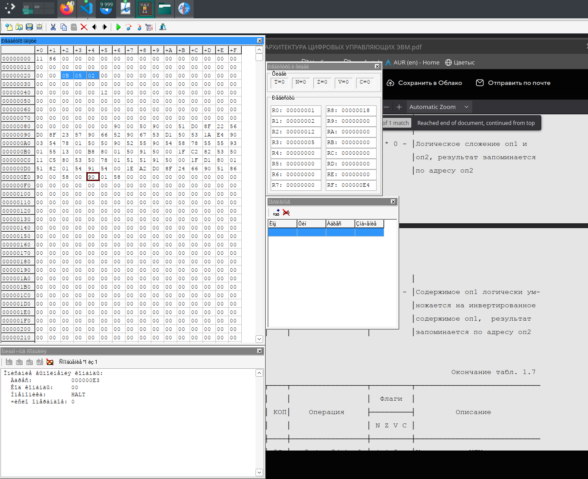

# Задание

Деление целых чисел без знака для получения целого числа без восстановления остатка с неподвижным делителем и сдвигом делимого

# Задание по варианту

Номер алгоритма 14 mod 16 + 1 = 15

Разрядность: 14 mod 7 + 4 = 4

Адрес начала расположеня испходных данных: $ 14 + 20 = 34_10 = 22_16 $

Адрес начала рпсположения команд программы: $ 14 + 120 = 134_10 = 86_16 $

Типы адресации: 1 + 14mod18 = 15

Тип1 (Перенос данных из памяти в регистры): 6 - косвенная регистровая (простая косвенная)  
Тип2 (Сохранение результата в память): 9 - косвенная автоинкрементная (двойная косвеннаяс автоувеличением)

# Блок-схема алгоритма

# Код программы на языке ассемблера ARM

| Мнемокод                | HEX код              | Комментарий                                             |
| ----------------------- | -------------------- | ------------------------------------------------------- |
| movb    0, r0           | 90 00 50             | # Остаток R = 0                                         |
| movb    0, r1           | 90 00 51             | # Результат Q = 0                                       |
| movl    #22, r6         | d0 8f 22 56          | # r6 указывает на A                                     |
| movl    #23, r7         | d0 8f 23 57          | # r7 указывает на B                                     |
| movb    (r6), r2        | 90 66 52             | # Загружаем A в r2                                      |
| movb    (r7), r3        | 90 67 53             | # Загружаем B в r3                                      |
| cmpl    r0, r3          | d1 50 53             | # Сравниваем R с B                                      |
| bgtru   overflow        | 1A *overflow*        | # если R >= B, переходим в overflow                     |
| movb    3, r4           | 90 03 54             | # i = 3                                                 |
| ashl    01, r0, r0      | 78 01 50 50          | # R = (R << 1)                                          |
| movb    r2, r5          | 90 52 55             | # Кладём A в r5                                         |
| mcomb   r4, r8          | 90 54 58             | # кладём в r8 инвертированную r4, чтобы сдвигать влево  |
| ashl    r8, r5, r5      | 78 55 55             | # A >> i                                                |
| bitb    01, r5          | 93 01 55             | # (A >> i) & 1                                          |
| beql    00  afteradd    | 13 00 *afteradd*     | # если i-ный бит А оказался 0 - пропускаем увеличение R |
| addb2   01, r0          | 80 01 50             | # инкрементируем R                                      |
| cmpb    r0, 00          | 91 50 00             | # Сравниваем R с 0                                      |
| blssu   plus_b          | 1f *plus_b*          | # Если R < 0, прыгаем в plus_b                          |
| subb2   r3, r0          | 82 53 50             | # Уменьшаем R на B                                      |
| brb     cont            | 11 *CONT_ADDRESS*    | # Перепрыгиваем увеличение                              |
| addb2   r3, r0          | 80 53 50             | # Увеличиваем R на B                                    |
| ashl    01, r1, r1      | 78 01 51 51          | # Q = Q << 1 (Сдвигаем Q влево на 1)                    |
| cmpb    r0, 00          | 91 50 00             | # Снова сравниваем R с 0                                |
| blssu   dec_i_and_check | 1f *dec_i_and_check* | # Если меньше, то перепрыгиваем инкрементацию Q         |
| addb2   01, r1          | 80 01 51             | # Иначе увеличиваем Q                                   |
| subb2   01, r4          | 82 01 54             | # i -= 1                                                |
| cmpb    r4, 00          | 91 54 00             | # Проверяем что i >= 0                                  |
| bge     i_loop          | 1e *i_loop*          | # если да, прыгаем назад, иначе идём дальше             |
| movl    #24, r6         | d0 8f 24 66          | # r6 указывает на result                                |
| movb    r1, (r6)+       | 90 51 86             | # Сохраняем Q в память и инкрементируем r6              |
| movb    00, r8          | 90 00 58             | # Успешное завершение                                   |
| HALT                    | 00                   |                                                         |
| movb    01, r8          | 90 01 58             | # Переполнение - деление невозможно                     |
| halt                    | 00                   | # Останавливаем выполнение                              |
:Используемые регистры

| Адрес | Что лежит        |
| :---- | ---------------- |
| R0    | Остаток R        |
| 24,R1 | Результат Q      |
| 22,R2 | Делимое (A)      |
| 23,R3 | Делитель (B)     |
| R4    | i счетчик        |
| 86    | Начало программы |

# Результат работы программы

